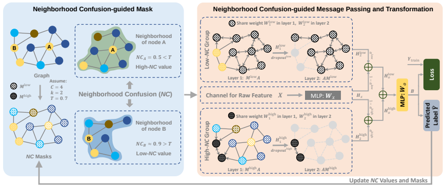
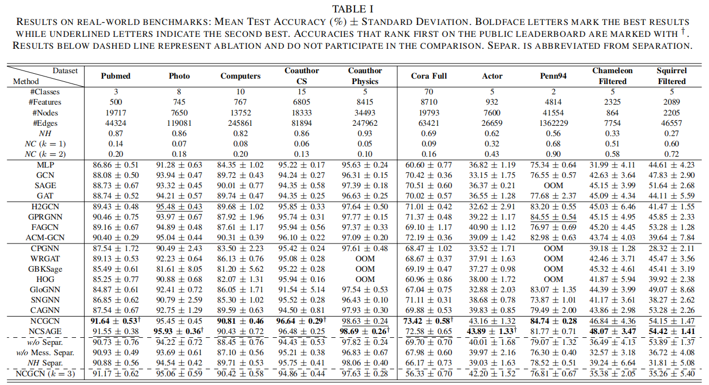

# Clarify Confused Nodes via Separated Learning
In this paper, we first propose a new metric, termed Neighborhood Confusion (NC), to facilitate a more reliable separation of nodes. These pave the way for Neighborhood Confusion-guided Graph Convolutional Network (NCGCN), in which nodes are grouped by their NC values and accept intra-group weight sharing and message passing. 

[[Arxiv](https://arxiv.org/pdf/2306.02285)] [[IEEE](https://ieeexplore.ieee.org/abstract/document/10840207/)]

### 1 Overview of Model Architecture and Performance




### 2 Python environment setup with Conda
```bash
conda env create -f requirement.yaml
```

### 3 Data Preparation
For all datasets, we adopt dense data splitting as in [20], i.e., randomly split them into training, validation and testing sets with a proportion of 60%/20%/20%.

### 4 Code Execution
#### 4.1 File Structure
- data -- put data in this dir
- model -- GCN(NCGCN) model
- index -- index of nodes' neighborhood
- main.py -- run this 
- utils.py -- utils

#### 4.2 Code Execution
```bash
python main.py -D computers -M NCGCN
```

#### 4.3 Hyper-parameter Space
- learning rate: [1e-3, 5e-3, 1e-2, 5e-2, 0.1]
- weight decay: [0, 5e-5, 1e-4, 5e-4, 1e-3]
- dropout rate: [0, 0.9] with 0.1 interval
- hop k: [1, 2]
- Threshold T: [0.3, 0.4, 0.5, 0.6, 0.7]
- Add self-loop or not: [True, False]

### 5 Citation
If you find this work useful, please cite our paper:
```
@article{zhou2025ncgnn,
  title={Clarify Confused Nodes via Separated Learning},
  author={Zhou, Jiajun and Gong, Shengbo and Chen, Xuanze and Xie, Chenxuan and Yu, Shanqing and Xuan, Qi and Yang, Xiaoniu},
  journal={IEEE Transactions on Pattern Analysis and Machine Intelligence},
  year={2025},
  volume={47},
  number={4},
  pages={2882-2896}
}
```
